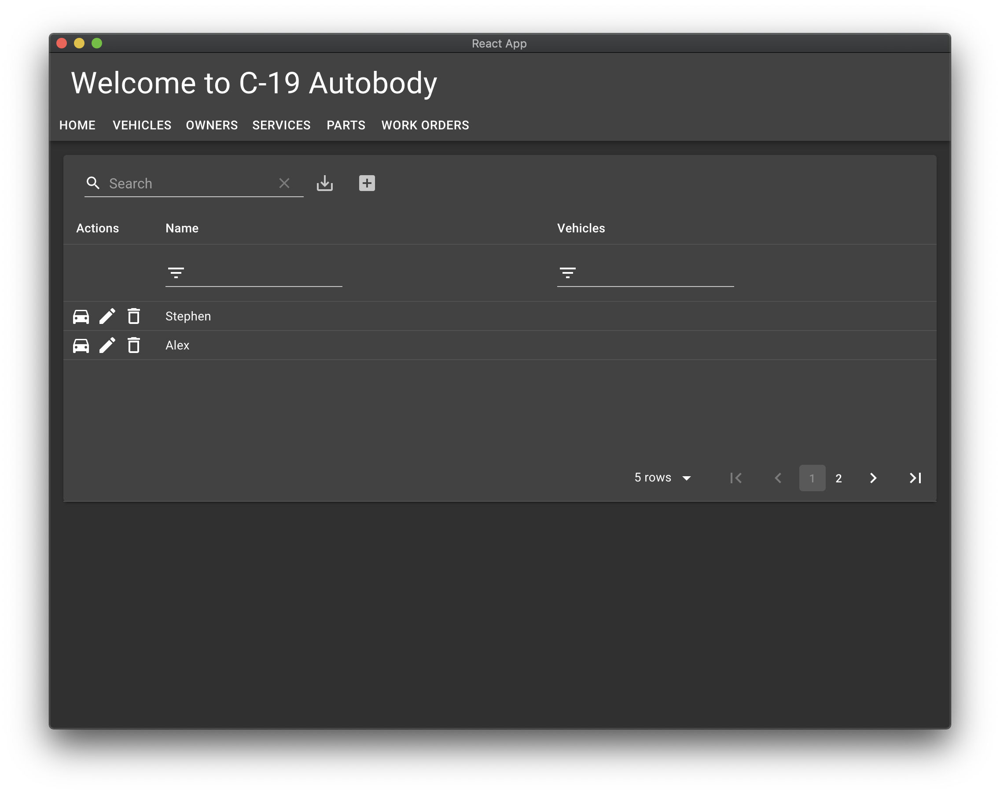
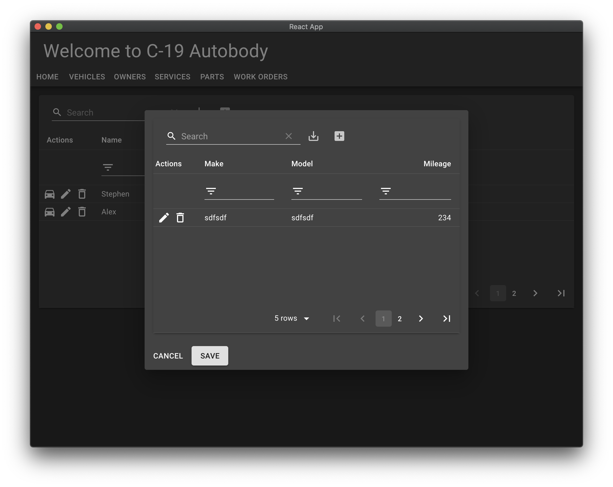

This is getting interesting. 

## Add the relationship

We need to add a relation from `Owner` to `Vehicle`. Then we need to be able to edit the relations right there in the table.

Looking at <https://docs.amplify.aws/cli/graphql-transformer/overview> we give a go.

```
type Vehicle @model {
  id: ID!
  make: String!
  model: String!
  mileage: Int
  owner: Owner @connection(name: "OwnerVehicles")
}

type Owner @model {
  id: ID!
  name: String!
  vehicles: [Vehicle]! @connection(name: "OwnerVehicles")
}

type Part @model {
  id: ID!
  description: String!
  price: Float!
  inventory: Int
}

type Service @model {
  id: ID!
  name: String!
}
```

```shell
amplify codegen models
```

There's a nuance here. GraphQL does not support a relationship where both sides of the relation are optional. So it makes sense to own a list of vehicles including an empty list. And then a vehicle either has an owner or not.

Take a look at what we changed

```shell
amplify status
```

```
| Category | Resource name   | Operation | Provider plugin   |
| -------- | --------------- | --------- | ----------------- |
| Api      | c192            | Update    | awscloudformation |
| Hosting  | S3AndCloudFront | No Change | awscloudformation |
```

And

```shell
amplify push
```

While that's going, we see the models have changed just like we'd expect

```typescript
export declare class Vehicle {
  readonly id: string;
  readonly make: string;
  readonly model: string;
  readonly mileage?: number;
  readonly owner?: Owner;
  constructor(init: ModelInit<Vehicle>);
  static copyOf(source: Vehicle, mutator: (draft: MutableModel<Vehicle>) => MutableModel<Vehicle> | void): Vehicle;
}

export declare class Owner {
  readonly id: string;
  readonly name: string;
  readonly vehicles?: Vehicle[];
  constructor(init: ModelInit<Owner>);
  static copyOf(source: Owner, mutator: (draft: MutableModel<Owner>) => MutableModel<Owner> | void): Owner;
}
```

## Edit Owners/Vehicles

We're going to extend `AwesomeTable` to let us manage vehicles owned by Owners. Sounds hard. Let's give it a go.

First, let's make using the table more idiomatic. `AwesomeTable` is React `Component`. Let's use it that way.

Replace

```typescript
const Vehicles = () => {
    return AwesomeTable<Vehicle>({
        model: Vehicle,
        columns,
        searchCriteria,
        instanceFor,
        updater
    })
}

export default Vehicles;
```

with

```typescript
import React from "react";
```

```typescript
const Vehicles = () => {
    return (
        <AwesomeTable
            model={Vehicle}
            columns={columns}
            searchCriteria={searchCriteria}
            instanceFor={instanceFor}
            updater={updater}
        />
    );
}

export default Vehicles;
```

Now let's turn our attention to `Owners.tsx`. This where we want to manage the vehicles someone owns.

!!! tip
    An idea! Now `AwesomeTable`'s a proper React `Component` maybe we can just use that table intact... not sure yet.

    We start off that way anyway and see where it gets us.
 
Let's bring up `Vehicles.tsx` in a dialog as follows.

Add some "actions" to `AwesomeTableProps` so we can open the dialog. 

```typescript hl_lines="8"
export interface AwesomeTableProps<T extends PersistentModel> {
    model: PersistentModelConstructor<T>,
    columns: Column<T>[];
    searchCriteria: (query: Query<T>, condition: ModelPredicate<T>) => ModelPredicate<T>
    instanceFor: (newData: any) => T;
    updater: (original: T, newData: any) => T;
    actions?: Action<T>[];
}
```

Don't forget to pass it to `MaterialTable`

```typescript hl_lines=""
<MaterialTable
    tableRef={tableRef}
    data={data}
    columns={props.columns}
    editable={editable}
    localization={localization}
    options={options}
    actions={props.actions}
/>
```

In `Owners.tsx` we'll need some state for the dialog open/close, click handlers, a groovy icon for the clickable action, and an action so the table knows what to do.

```shell
yarn add @material-ui/icons
```

```typescript
import DirectionsCar from '@material-ui/icons/DirectionsCar';
```

```typescript
    const [dialogOpen, setDialogOpen] = React.useState(false);

    const handleClose = (value: any) => {
        setDialogOpen(false);
    };

    const openAction: Action<Owner> = {
        icon: () => <DirectionsCar />,
        onClick: (event, owner) => {
            setDialogOpen(true);
        }
    };

    const actions = [
        openAction
    ]
```

Now pass in the actions

```typescript
<AwesomeTable
    model={Owner}
    columns={columns}
    searchCriteria={searchCriteria}
    instanceFor={instanceFor}
    updater={updater}
    actions={actions}
/>
```
And make a dialog. We'll put `AwesomeTable` inside a `Card` inside a `Dialog`.

```typescript
    return (
        <div>
            <AwesomeTable
                model={Owner}
                columns={columns}
                searchCriteria={searchCriteria}
                instanceFor={instanceFor}
                updater={updater}
                actions={actions}
            />
            <Dialog open={dialogOpen} onClose={handleClose}>
                <Card>
                    <CardContent>
                        <Vehicles />
                    </CardContent>
                    <CardActions color="blue" >
                        <Button onClick={handleClose}>Cancel</Button>
                        <Button onClick={handleClose} variant="contained">Save</Button>
                    </CardActions>
                </Card>
            </Dialog>
        </div>
    );
```

Try it.

The action button is a car icon.



Click it to get a dialog.



That's a smaller version of the vehicles table. So far, so good.

## Add vehicle selection

We need at least a couple of things

* Display the current owner and a list of their vehicles.
* Search all vehicles and add/change ownership.
* A function to update the database when a selection changes.

Let's start with selection.

We don't want all tables to be selectable by default — just the tables for relationships — so we need to pass that option.


