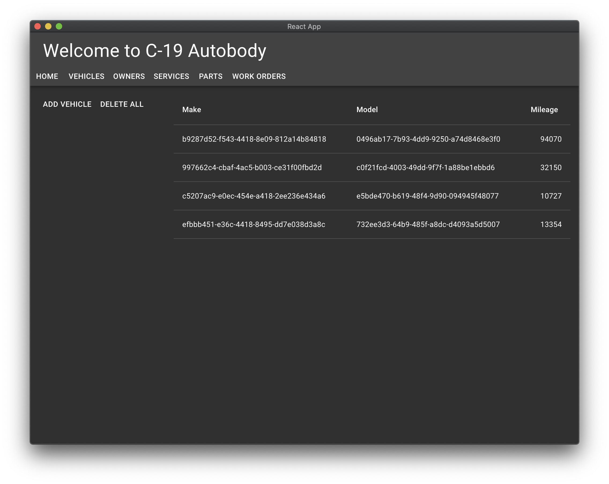

We just got the button hooked up and printed out the state. Clearly JSON is not a good format for mortals. Let's create a table.

Luckily it's easy. Import more elements from `@material-ui/core`.

```typescript
import { Button, Table, TableHead, TableRow, TableCell, TableBody } from '@material-ui/core';
```

Replace the `return` statement with

```typescript
    return (
        <>
            <Button onClick={onClick}>Add vehicle</Button>
            <Table>
                <TableHead>
                    <TableRow>
                        <TableCell>Make</TableCell>
                        <TableCell>Model</TableCell>
                        <TableCell>Mileage</TableCell>
                    </TableRow>
                </TableHead>
                <TableBody>
                    {
                        vehicles.map((vehicle) => (
                            <TableRow>
                                <TableCell>{vehicle.make}</TableCell>
                                <TableCell>{vehicle.model}</TableCell>
                                <TableCell align="right">{vehicle.mileage}</TableCell>
                            </TableRow>
                        ))
                    }
                </TableBody>
            </Table>
        </>
    );
```

Let's unpack that.

We need `<>` ... `</>` around all the elements because as there can only be one top-level element. We have two: The `<Button>` and the `<Table>`.

!!! hint
    The table definition is the analog of basic HTML tables with a head and a body. 

The `{` ... `}` inside the `<TableBody>` lets us run display logic, in this case loop over the vehicles and generate table rows. There must be only one statement inside `{` ... `}` and that code must return React elements.

Try it. Not bad. But there's more.

## Layout likes to be on a grid

Responsive UI frameworks are usually based around the idea of layout in twelve columns. React is one of those frameworks.

The layout of the page without a grid is actually OK. If we had lots of elements it might be hard to add all the spacing by hand to get things even. And if we didn't like it there'd be lots of place to change it. We can control all the layout you need with grids.

Another thing's irksome. The button's always on a line on its own, even when the page is wide enough to have the button on the left and the table in the remaining space. There's room. Let's do it.

Add a `<Grid>` with some spacing around the `<Button>` and `<Table>` elements. 

```typescript
import { Grid } from '@material-ui/core';
```

```typescript
<Grid container spacing={2}>
    <Button onClick={onClick}>Add vehicle</Button>
    <Table>
        ...
    </Table>
</Grid>
```

Refresh. Not much difference. That's because a `<Grid container>` lays out `<Grid item>`s and we don't have any yet.

Add the two items inside the container. 

```typescript
<Grid container spacing={2}>
    <Grid item>
        <Button onClick={onClick}>Add vehicle</Button>
    </Grid>
    <Grid item>
        <Table>
            ...
        </Table>
    </Grid>
</Grid>
```

This lays out the button and table items side-by-side. Try resizing the screen. Things move around as the screen size changes.

We want to lay out grid items in an actual grid. We saw the default for `<Grid item>` is to flow items. That's really not very gridy.

We can specify _breakpoint values_ for items (any number of `xs`, `sm`, `md`, `lg`, and `xl` values) with a column span, which can be `1` (1 column) through `12` (the whole row.) Each breakpoint defines the behavior of responsive design, the way page layout changes to accommodate different screen sizes.

!!! info
    See <https://material-ui.com/customization/breakpoints/> for the details.

So with all that, now

```typescript
<Grid container spacing={2}>
    <Grid item xs={12} sm={3}>
        <Button onClick={onClick}>Add vehicle</Button>
    </Grid>
    <Grid item xs={12} sm={9}>
        <Table>
            ...
        </Table>
    </Grid>
</Grid>
```

will layout both the button and the table full width if the screen size is less than 600px. and side-by-side if the size if 600px or above.

Try waggling the bottom-right corner of the browser around to see the button and table move relative to each other. This is responsive design at work with defined columns.

!!! hint
    `<Grid container spacing={??}>` adds spacing between cells of the grid: It does not affect margins of the grid container itself. You can try different values for the padding and see this work.

## The upshot

We built a super simple application that has a UI and a backend.

We see how the application is synchronized across all open browsers.

We're starting to use responsive design.

iPad portrait


iPad landscape



We added an array of Vehicles as state, a button to add a new one with some random values for the fields for `make`, `model`, and `mileage`, and a list of them that updates as we add a vehicle.

The table's pretty lame: There's no pagination, editing, sorting, or filtering. That's in our future.

Here's the whole file, `Vehicles.tsx` with everything we did.

```typescript
import React from 'react';
import { Button, Table, TableHead, TableRow, TableCell, TableBody, Grid } from '@material-ui/core';
import { Vehicle } from './models';
import { uuid } from 'uuidv4';

function Vehicles() {
    const [vehicles, setVehicles] = React.useState<Vehicle[]>([]);

    function addVehicle() {
        const make = uuid();
        const model = uuid();
        const mileage = Math.floor(Math.random() * 100000) + 1
        const vehicle = new Vehicle({ make, model, mileage });

        setVehicles([...vehicles, vehicle]);
    }

    function onClick(event: React.MouseEvent) {
        console.log('event', event);

        addVehicle();

        event.preventDefault();
    }

    return (
        <Grid container spacing={2}>
            <Grid item xs={12} sm={3}>
                <Button onClick={onClick}>Add vehicle</Button>
            </Grid>
            <Grid item xs={12} sm={9}>
                <Table>
                    <TableHead>
                        <TableRow>
                            <TableCell>Make</TableCell>
                            <TableCell>Model</TableCell>
                            <TableCell>Mileage</TableCell>
                        </TableRow>
                    </TableHead>
                    <TableBody>
                        {
                            vehicles.map((vehicle) => (
                                <TableRow>
                                    <TableCell>{vehicle.make}</TableCell>
                                    <TableCell>{vehicle.model}</TableCell>
                                    <TableCell align="right">{vehicle.mileage}</TableCell>
                                </TableRow>
                            ))
                        }
                    </TableBody>
                </Table>
            </Grid>
        </Grid>
    );
}

export default Vehicles;
```

Now we're going to integrate the UI we just made with the backend database.

### Adding a "delete all" button is easy

Add the button

```typescript
<Grid item xs={12} sm={3}>
    <Button onClick={onClick}>Add vehicle</Button>
    <Button onClick={onDeleteAll}>Delete all</Button>
</Grid>
```

And a handler

```
function onDeleteAll(event: React.MouseEvent) {
    console.log('event', event);

    setVehicles([]);

    event.preventDefault();
}
```

We like React hooks.
