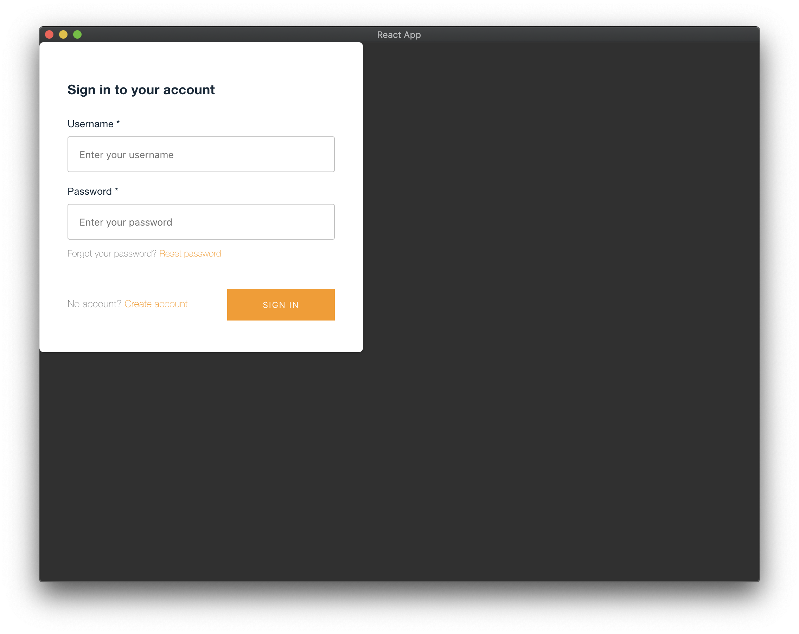
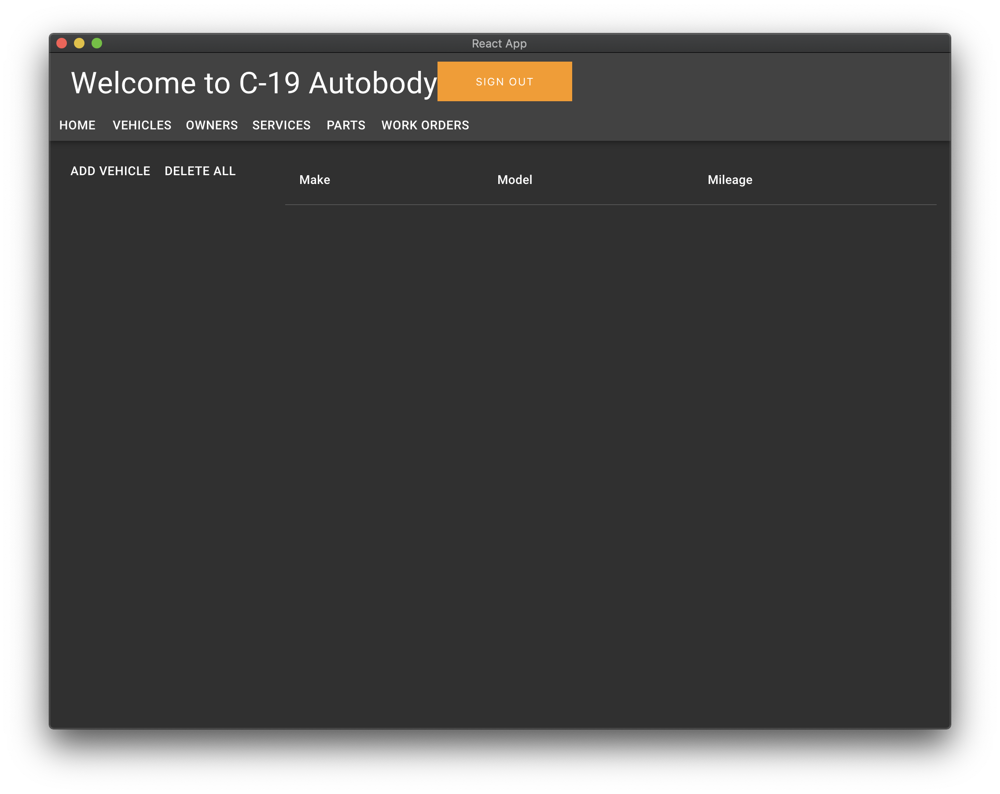
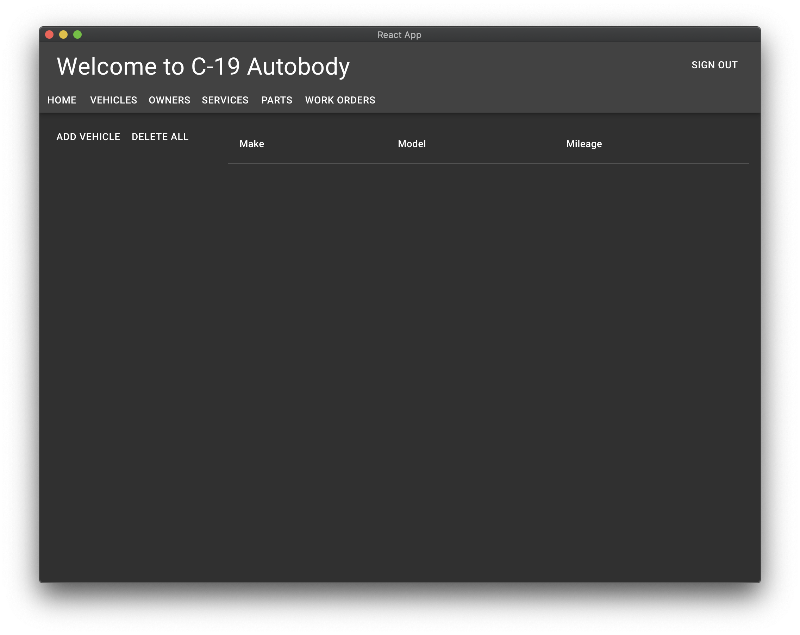
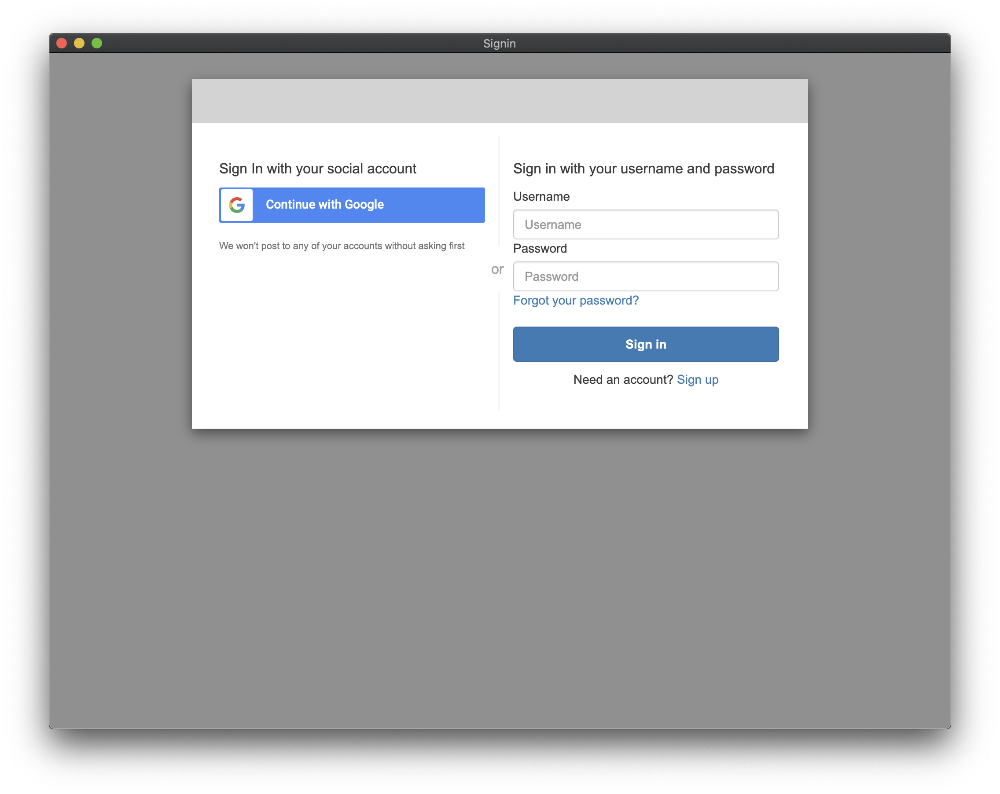

!!! warning
    Authentication is a bit of a sticky wicket.

    You basically have two choices

    - Use the provided authentication workflow
    - Use federated social login with a hosted UI

    The provided authentication UI with sing-in/up is hard to theme to look ike it's part of the application. The federated hosted UI is pretty good, except I'm not going to assume you can create applications for the OAuth callbacks in Google Cloud or Facebook.

    Proceed with that in mind, or just skip to the next section. 

Amplify Authentication provides almost all we need out of the box.

- Sign up with OTP
- Sign in
- Forgot password

See <https://docs.amplify.aws/lib/auth/getting-started/q/platform/js> for details. But it basically comes dow th the following.

It's just the standard UI is all orange, which is the standard Amplify theme. Luckily for us, the awesome folks at AWS Amplify have a pretty solid set of reusable React components and a board Auth API. Let's dig in.

## Add authentication to `App.tsx`

```typescript
import { withAuthenticator } from '@aws-amplify/ui-react'
```

```typescript
export default withAuthenticator(App);
```

Try it.



Ugly for so many reasons. But it doesn't no work. You can sign up and sign in!

We need to sign out. Let's try.

```typescript
import { withAuthenticator, AmplifySignOut } from '@aws-amplify/ui-react'
```

```typescript
<Toolbar>
    <Typography variant="h4" >Welcome to C-19 Autobody</Typography>
    <AmplifySignOut />
</Toolbar>
```



Let's fix it by calling the `Auth` API from a React Material button. 
```typescript
import React, { MouseEvent } from 'react';
```

```typescript
function onSignOut(event: MouseEvent<HTMLButtonElement>) {
    event.preventDefault();

    Auth
        .signOut()
        .then(console.log)
        .catch(console.error)
}
```

We'll need to left-align the button.


```typescript
const useStyles = makeStyles((theme) => ({
    content: {
        // top, right, bottom, left
        margin: theme.spacing(2, 2, 0, 2)
    },
    title: {
        flexGrow: 1
    }
}));
```

And tie everything together

```typescript hl_lines="5 6"
    return (
        <>
            <AppBar color="inherit" position="static">
                <Toolbar>
                    <Typography variant="h4" className={classes.title}>Welcome to C-19 Autobody<Typography>
                    <Button onClick={onSignOut}>Sign out</Button>
                </Toolbar>
                <div>
                    ...
```



Nice.

## Make a login screen for React Material

!!! note
    There's a lot written about this. But none of it quite works for React Material, or works at with hte vewsions of Amplify and REact we're using here. See [Here](https://blog.logrocket.com/authentication-react-apps-aws-amplify-cognito/), [here](https://blog.kylegalbraith.com/2020/03/31/customizing-the-aws-amplify-authentication-ui-with-your-own-react-components/), [here](<https://medium.com/@howitson/how-i-managed-to-customize-aws-amplify-login-screens-8d85d0967849>), [here](https://dev.to/dabit3/the-complete-guide-to-user-authentication-with-the-amplify-framework-2inh), and [here](https://blog.logrocket.com/authentication-react-apps-aws-amplify-cognito/) for some of the closest we found. There are many more.

## Use the hosted federated login

You can follow the instructions <https://docs.amplify.aws/lib/auth/social/q/platform/js> to make this work. You'll need access to developer accounts in Facebook or Google to create applications to use in the OAuth integration.

When you're done, it looks something like


