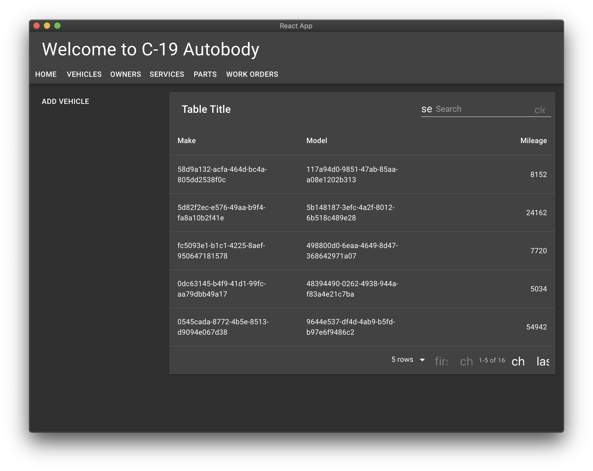
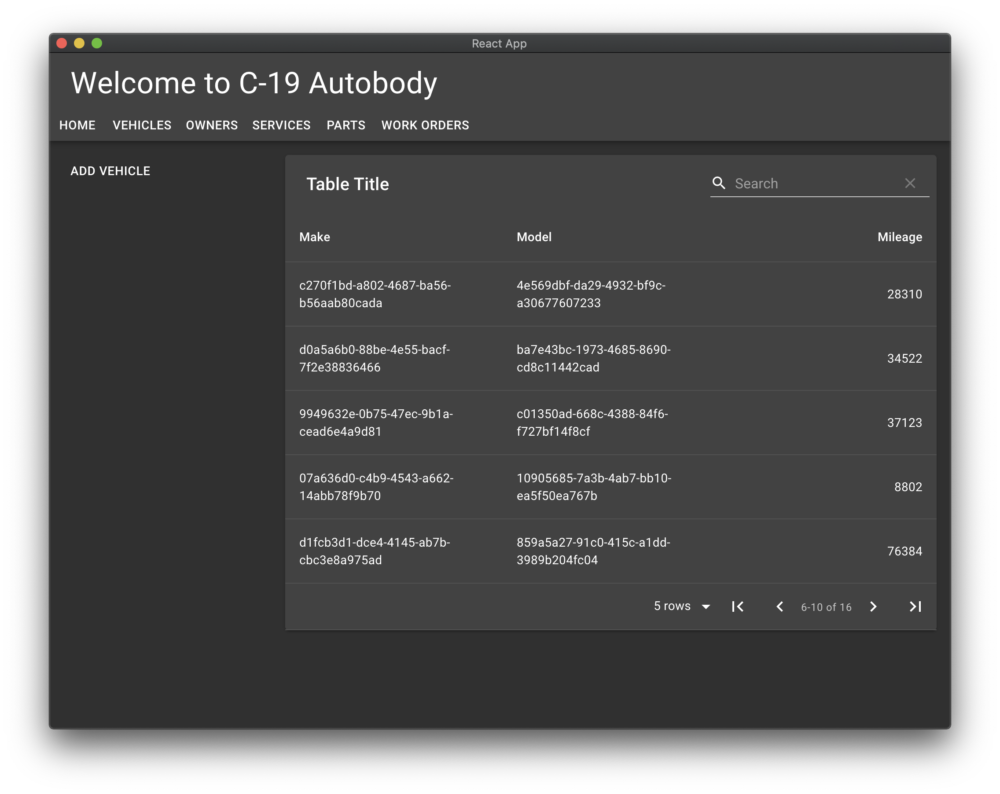
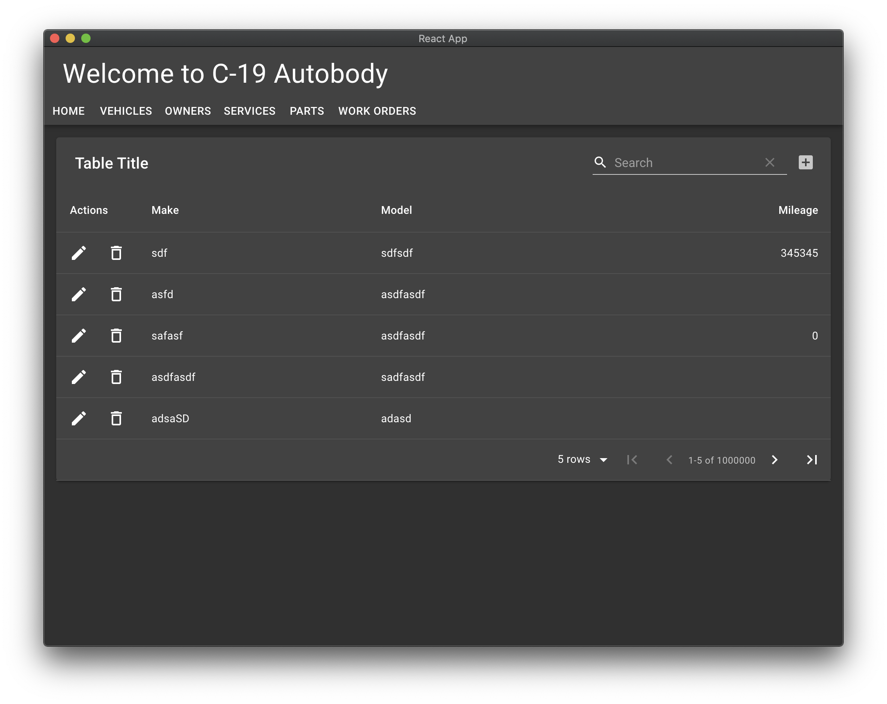

As we already saw, the table that displays all the vehicles is lame. It does not paginate and it only works on all the vehicles at once. It does not let you create, update, or delete data within the table. In addition, we had to create the table from scratch using the basic elements of Material UI. 

Let's fix that. Or better still, let someone else fix it for us. Enter the magnificent Material Table, <https://material-table.com>. 

We're just about to make some big changes to `Vehicle.tsx` with quite a few steps. As always, if you want to skip the steps and see the end result check "The upshot" section.

## Start simple

Let's hook up Material Table to the existing data.

Add the dependency

```shell
yarn add material-table
```

Import it.

```typescript
import MaterialTable from 'material-table'
```

There's a ton of options for each column so we use the type `Column` to leverage editor completion. Always nice. `numeric` aligns right.

And define some column metadata.

```typescript
import MaterialTable, { Column } from 'material-table';

const columns: Column<Vehicle>[] = [
    { title: 'Make', field: 'make' },
    { title: 'Model', field: 'model' },
    { title: 'Mileage', field: 'mileage', type: "numeric" },
];
```

Now we have everything we need to replace our old table with the nice one.

```typescript
return (
    <Grid container spacing={2}>
        <Grid item xs={12} sm={3}>
            <Button onClick={onClick}>Add vehicle</Button>
        </Grid>
        <Grid item xs={12} sm={9}>
            <MaterialTable
                data={vehicles}
                columns={columns}
            />
        </Grid>
    </Grid>
);
```

Try it. Ugh. We broke something and the page is blank. Let's check the console.

Material Table requires a mutable `id` on each row. AWS Amplify provides a different `id`, but it's `readonly`. So things won't work if you just pass a `Vehicle` around for rows. A quick fix is map each `Vehicle` to an untyped object. I chased this down and figured out the fix so you don't have to.

The function `rowMapper(...)` does this.

```typescript
function rowMapper(vehicles: Vehicle[]): Vehicle[] {
    return vehicles.map(vehicle => {
        return { ...vehicle }
    });
}
```

Now `<MaterialTable>` looks like

```typescript
return (
    <Grid container spacing={2}>
        <Grid item xs={12} sm={3}>
            <Button onClick={onClick}>Add vehicle</Button>
        </Grid>
        <Grid item xs={12} sm={9}>
            <MaterialTable
                data={rowMapper(vehicles)}
                columns={columns}
            />
        </Grid>
    </Grid>
);
```
Try it again. Ugh. Although Material Table is showing promise, it looks like we need some icons. 



Follow the instructions in <https://material-table.com/#/docs/install>.

Yay. This table's looking properly amazing now. Search works for string and numeric fields. 



## But of course we're not stopping here

We're not, because this is a tutorial about React Material UI, Material Table and how to integrate with AWS Amplify. There's still lots to do before we're awesome.

Try pressing the "ADD VEHICLE" button. See the total increase? Cool. Press it 1,000 more times. It slows down. A lot. Retrieving all the vehicles every time clearly doesn't scale. Not so cool.

Let's paginate. But first — in a bold move bordering on reckless — remove the `vehicles` state and the `fetchAll()` function. Comment it out in `subscriber()`. We're clearly going need something here, and this will remind us.

`function Vehicles()` now starts

```typescript
function Vehicles() {
    useEffect(() => {
        function subscriber(subscriptionMessage: SubscriptionMessage<Vehicle>) {
            console.log('subscriptionMessage', subscriptionMessage);

            // fetchAll();
        }

        const subscription = DataStore
            .observe(Vehicle)
            .subscribe(subscriber);

        return () => { subscription.unsubscribe(); };
    }, []);

    function addVehicle() {
        ...
```

The `data` property in `<MaterialTable ... />` can also take a function instead of a simple array.

Fields in the function argument, the query, allow us to retrieve just the right single page of vehicles, solving the fetch-everything-at-once ugliness. We'll take `query.page` and `query.pageSize` and call `DataStore.query()` to get just the right page. Oh, and `data` needs a `Promise` now. Oh, and `DataStore.query()` needs a predicate now, even the always-true predicate.

```typescript
import MaterialTable, { Column, Query, QueryResult } from 'material-table';
```

```typescript
function data(query: Query<Vehicle>): Promise<QueryResult<Vehicle>> {
    return new Promise((resolve, reject) => {
        const thisPage = {
            page: query.page,
            limit: query.pageSize
        };

        DataStore
            .query(Vehicle, Predicates.ALL, thisPage)
            .then(vehicles => {
                resolve({
                    data: rowMapper(vehicles),
                    page: query.page,
                    totalCount: 1000000
                });
            })
            .catch(reject);
    })
}
```

## We broke some things

Only first page is displayed. And we don't refresh when we add a vehicle. (You might have noticed we set `totalCount` to a large number to get something going until we solve this.)

There are a couple of reasons for this. For pagination to work correctly, Material Table needs to know the total number of rows. That used to be easy because we had all the rows. But now we only have a page at a time. 

!!! note "Harder than you think"
    It's because we're using GraphQL backed by DynamoDB. DynamoDB does not work like SQL where you can `SELECT COUNT(*) ...` or something. There's no way to get the total number without scanning a whole table, which is prohibitively expensive for large tables.

    We're going to solve this another way. But fair warning, this is going to feel like we don't know what we're doing. 

### Search is broken now too

It looks like there's a bad interaction between what we're now doing in Material Table and how we're using Amplify DataStore to fetch a page. Let's fix it.

`DataStore.query(...)` takes a predicate, specifically a function that takes a `ModelPredicate<Vehicle>` and returns one too. Our task is to add some criteria to this predicate.

We can take `query.search` and create criteria. Start with the `make` field in vehicle.

```typescript
function data(query: Query<Vehicle>): Promise<QueryResult<Vehicle>> {
    return new Promise((resolve, reject) => {
        const thisPage = {
            page: query.page,
            limit: query.pageSize
        };

        function searchCriteria(predicate: ModelPredicate<Vehicle>): ModelPredicate<Vehicle> {
            return predicate.make("contains", query.search);
        }

        DataStore
            .query(Vehicle, searchCriteria, thisPage)
            .then(vehicles => {
                resolve({
                    data: rowMapper(vehicles),
                    page: query.page,
                    totalCount: 1000000
                });
            })
            .catch(reject);
    })
}
```

Now we can type a search term and get matching vehicle makes. Nice. Compound criteria are constructed like this

```typescript
predicate.make("contains", query.search).model("contains", query.search)
```

but when we try it we discover that is an `and` criterion. We need `or`. This is the right incantation for that.

```typescript
function searchCriteria(predicate: ModelPredicate<Vehicle>): ModelPredicate<Vehicle> {
    return predicate.or(or =>
        or.make("contains", query.search)
            .model("contains", query.search));
}
```

Adding search on `mileage` is easy too: We just have to think of a reasonable semantics. "Is greater than or equal" is probably better than "contains these digits." Now we have

```typescript
function searchCriteria(predicate: ModelPredicate<Vehicle>): ModelPredicate<Vehicle> {
    return predicate.or(or =>
        or.make("contains", query.search)
            .model("contains", query.search)
            .mileage("ge", parseInt(query.search, 10)));
}
```

Search is fixed. And the &ge; semantics for mileage looks like a good call.

We see there's a default title that's not very useful. Let's leave all the polish like this until after everything's working.

## Triggering refresh

We can add vehicles as before, but they're not showing up in the table. We need to connect the subscription to the table. 

It's pretty easy if you know how. We need to bind the table to a reference and use that to trigger a refresh.

```typescript
import React, { useEffect, createRef } from 'react';
import MaterialTable, { Column, Query, QueryResult, MaterialTableProps } from 'material-table'
```

Add the reference.

```typescript
const tableRef = createRef<MaterialTableProps<Vehicle>>();
```

Now bind it to the table like this.

```typescript
<MaterialTable
    tableRef={tableRef}
    data={data}
    columns={columns}
/>
```

Now all we have to do to trigger a refresh on the table when we get an event from the subscription. It's a bit finicky.

We going to trip the table's `onQueryChange()` hook. That function requires some arguments, which we mostly relay from the current table state. There are a couple of things we didn't figure out how to get like the current `orderBy`. Irksome, but not a deal-breaker.

Ever wonder what that empty `[]` was in the `useEffect()` hook declaration? Well it's for passing dependencies. `tableRef` is a dependency.

### The new `useEffect`

```typescript
useEffect(() => {
    function subscriber(msg: SubscriptionMessage<Vehicle>) {
        console.log('subscription', msg.opType);

        if (tableRef.current) {
            const table = tableRef.current;

            if (table.onQueryChange) {
                table.onQueryChange({
                    filters: [],
                    orderBy: {},
                    orderDirection: 'asc',
                    page: table.page || 0,
                    pageSize: table.options?.pageSize || 5,
                    search: table.options?.searchText || ''
                });
            }
        }
    };

    const subscription = DataStore
        .observe(Vehicle)
        .subscribe(subscriber);

    return () => { subscription.unsubscribe(); };
}, [tableRef]);
```

Try it. Much better.

Remember that if you want to delete all existing vehicles and start adding new one, you can add a `<Button>` and call `DataStore`. Like this

```typescript
<Grid item xs={12} sm={3}>
    <Button onClick={onClick}>Add vehicle</Button>
    <Button onClick={onDeleteAll}>Delete all</Button>
</Grid>
```

```typescript
function onDeleteAll(event: React.MouseEvent) {
    DataStore
        .delete(Vehicle, Predicates.ALL)
        .then(console.log)
        .catch(console.error)

    event.preventDefault();
}
```

Frankly, the bloom's off the rose when we notice just how much we're redrawing of the table. We'll see if we can fix that later when we polish. It's probably because we're handling all events the same. Maybe we shouldn't. We'll see.

## Manipulating items from the table itself

!!! note
    If you want to skip the details of making rows editable, fast-forward to [The upshot](#the-upshot). There's quite a bit of faffing about from here on.

The "ADD VEHICLE" button has a bunch of issues. Let's move that functionality to the table. Removing buttons simplifies the layout.

Material Table provides hooks for CRUD operations right in the table. The hooks are defined like this

```typescript
  editable?: {
    isEditable?: (rowData: RowData) => boolean;
    isDeletable?: (rowData: RowData) => boolean;
    onRowAdd?: (newData: RowData) => Promise<any>;
    onRowUpdate?: (newData: RowData, oldData?: RowData) => Promise<any>;
    onRowDelete?: (oldData: RowData) => Promise<any>;
  }
```

Let's add them one-by-one. We can start with no hooks because all hooks are optional.

```typescript
const editable = {
};
```

```typescript
<MaterialTable
    tableRef={tableRef}
    data={data}
    columns={columns}
    editable={editable}
/>
```

```typescript
return (
    <Grid container spacing={2}>
        <Grid item xs={12}>
            <MaterialTable
                tableRef={tableRef}
                data={data}
                columns={columns}
                editable={editable}
            />
        </Grid>
    </Grid>
);
```

Test it. Nothing did nothing successfully.

Before we can edit a row that has optional fields — our `mileage` field — we need to define a value returned when omitted. This is easy: Just add it to the `Column` definition.

```typescript
const columns: Column<Vehicle>[] = [
    { title: 'Make', field: 'make' },
    { title: 'Model', field: 'model' },
    { title: 'Mileage', field: 'mileage', type: "numeric", emptyValue: '' },
];
```

## Adding a row

Add a function to edit a row. We get save and cancel buttons for free.

```typescript
const onRowAdd = (newData: Vehicle) =>
    new Promise((resolve, reject) => {
        const timeout = setTimeout(() => {
            const add = new Vehicle({
                make: newData.make,
                model: newData.model,
                mileage: newData.mileage
            });
            DataStore
                .save(add)
                .then(result => {
                    clearTimeout(timeout)

                    resolve(result);
                })
                .catch(reject)
        }, 1000);
    })

const editable = {
    onRowAdd,
}
```

Let's unpack this.

`onRowAdd` returns a `Promise`. That's easy: we just have to call `resolve` or `reject` like we already know.

We create a new `Vehicle` with the fields

`setTimeout(() => {...})` returns a `Timeout` (1000ms feels right.) We call `clearTimeout()` only if the save succeeds. Otherwise it's standard `Promise` handling.

## Now enable deleting a row

The function for `onRowDelete` looks very similar to that for `onRowAdd`.

```typescript
const onRowDelete = (oldData: any) =>
    new Promise((resolve, reject) => {
        const timeout = setTimeout(() => {
            DataStore
                .delete(Vehicle, oldData.id)
                .then(result => {
                    clearTimeout(timeout)

                    resolve(result);
                })
                .catch(reject)
        }, 1000);
    })

const editable = {
    onRowAdd,
    onRowDelete,
}

```

Try it. Yay, a rubbish bin. Still noticing quite a bit of table flash.

## Updating a row

```typescript
const onRowUpdate = (newData: any, oldData: any) =>
    new Promise((resolve, reject) => {
        const timeout = setTimeout(() => {
            DataStore
                .query(Vehicle, oldData.id)
                .then(original => {
                    const updated = Vehicle.copyOf(original, updated => {
                        updated.make = newData.make
                        updated.model = newData.model
                        updated.mileage = parseInt(newData.mileage, 10)
                    });

                    return DataStore.save(updated);
                })
                .then(result => {
                    clearTimeout(timeout)

                    resolve(result);
                })
                .catch(reject)
        }, 1000);
    })
```

The last one's a bit sneaky. It's chaining `Promise`s by returning a `Promise` from the first `.then`. Then `then` again. Just in case you didn't know a way to do this.

!!! done
    Oh wow. We just noticed we got column sorting for free with the default column metadata.

## The upshot

`Vehicles.tsx` so far is

```typescript
import React, { useEffect, createRef } from 'react';
import { Grid } from '@material-ui/core';
import { Vehicle } from './models';
import { DataStore, SubscriptionMessage ,ModelPredicate} from '@aws-amplify/datastore';
import MaterialTable, { Column, Query, QueryResult, MaterialTableProps, Options } from 'material-table'

const columns: Column<Vehicle>[] = [
    { title: 'Make', field: 'make' },
    { title: 'Model', field: 'model' },
    { title: 'Mileage', field: 'mileage', type: "numeric", emptyValue: '' },
];

function Vehicles() {
    const tableRef = createRef<MaterialTableProps<Vehicle>>();

    useEffect(() => {
        function subscriber(msg: SubscriptionMessage<Vehicle>) {
            console.log('subscription', msg.opType);

            if (tableRef.current) {
                const table = tableRef.current;

                if (table.onQueryChange) {
                    table.onQueryChange({
                        filters: [],
                        orderBy: {},
                        orderDirection: 'asc',
                        page: table.page || 0,
                        pageSize: table.options?.pageSize || 5,
                        search: table.options?.searchText || ''
                    });
                }
            }
        };

        const subscription = DataStore
            .observe(Vehicle)
            .subscribe(subscriber);

        return () => { subscription.unsubscribe(); };
    }, [tableRef]);

    function rowMapper(vehicles: Vehicle[]): Vehicle[] {
        return vehicles.map(vehicle => {
            return { ...vehicle }
        });
    }

    function data(query: Query<Vehicle>): Promise<QueryResult<Vehicle>> {
        return new Promise((resolve, reject) => {
            const thisPage = {
                page: query.page,
                limit: query.pageSize
            };

            function searchCriteria(predicate: ModelPredicate<Vehicle>): ModelPredicate<Vehicle> {
                return predicate.or(or =>
                    or.make("contains", query.search)
                        .model("contains", query.search)
                        .mileage("ge", parseInt(query.search, 10)));
            }

            DataStore
                .query(Vehicle, searchCriteria, thisPage)
                .then(vehicles => {
                    resolve({
                        data: rowMapper(vehicles),
                        page: query.page,
                        totalCount: 1000000
                    });
                })
                .catch(reject);
        })
    }

    const onRowAdd = (newData: any) =>
        new Promise((resolve, reject) => {
            const timeout = setTimeout(() => {
                const add = new Vehicle({
                    make: newData.make,
                    model: newData.model,
                    mileage: parseInt(newData.mileage, 10)
                });
                DataStore
                    .save(add)
                    .then(result => {
                        clearTimeout(timeout)

                        resolve(result);
                    })
                    .catch(reject)
            }, 1000);
        })

    const onRowDelete = (oldData: any) =>
        new Promise((resolve, reject) => {
            const timeout = setTimeout(() => {
                DataStore
                    .delete(Vehicle, oldData.id)
                    .then(result => {
                        clearTimeout(timeout)

                        resolve(result);
                    })
                    .catch(reject)
            }, 1000);
        })

    const onRowUpdate = (newData: any, oldData: any) =>
        new Promise((resolve, reject) => {
            const timeout = setTimeout(() => {
                DataStore
                    .query(Vehicle, oldData.id)
                    .then(original => {
                        const updated = Vehicle.copyOf(original, updated => {
                            updated.make = newData.make
                            updated.model = newData.model
                            updated.mileage = parseInt(newData.mileage, 10)
                        });

                        return DataStore.save(updated);
                    })
                    .then(result => {
                        clearTimeout(timeout)

                        resolve(result);
                    })
                    .catch(reject)
            }, 1000);
        })

    const editable = {
        onRowAdd,
        onRowDelete,
        onRowUpdate
    }

    return (
        <Grid container spacing={2}>
            <Grid item xs={12}>
                <MaterialTable
                    tableRef={tableRef}
                    data={data}
                    columns={columns}
                    editable={editable}
                />
            </Grid>
        </Grid>
    );
}

export default Vehicles;
```



