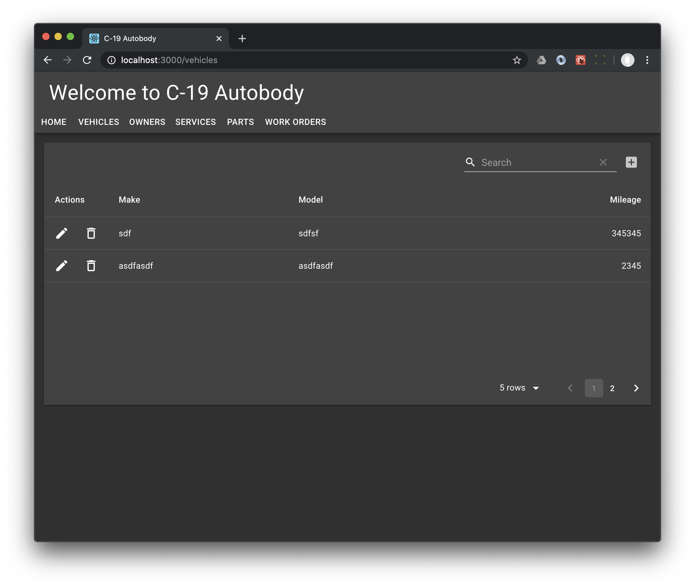

!!! note
    You can find me at <stephen@stephen.cloud> and <https://www.linkedin.com/in/stephenharrison/> and <https://github.com/stephen-cloud/> and <https://www.thelucidcoder.com> (nothing interesting there yet.)

## What's all this then?

Here is an end-to-end tutorial that shows how to create the C-19 Autobody sample application in <https://github.com/stephen-cloud/c-19-autobody> from scratch. 

This documentation is <https://stephen-cloud.github.io/c-19-autobody/>. You can see the finished application at <https://c-19-autobody.stephen.cloud>.

You can stop at the end of each section and have something interesting working.

## It's a tutorial

You can brush up your TypeScript here. 

You can learn about React Material and Material Table. 

We introduce AWS Amplify.

Why C-19 Autobody? Well, I was laid off from my online retail company as a result of COVID-19. Sales were down. A lot, and then some. So between talking to recruiters and having interviews, I learned lots of things I didn't know and put them together. And C-19 because I'm helping a buddy of mine with tech in his autobody shop. And I just saw an article on the C-19 antibody.

Here are the features and technologies we're using to implement in this demo.

| Feature | Technology |
| --- | --- |
| A type safe(r) programming language | TypeScript |
| Cloud-native and serverless | AWS Amplify |
| A User Interface | React Material |
| Sign-up, sign-in, forgot password | AWS Amplify Authentication |
| Google, Facebook, and other social providers | Federated Authentication |
| A back-end API | GraphQL schema definition + AWS Amplify GraphQL API |
| A database | AWS Amplify API + AWS DynamoDB |
| Subscribe to data changes; handle off-line edits | AWS AppSync | 

## Who is this for?

If you know React Material, Material Table, AWS Amplify, or any of the technologies above, you can skip the tutorials for those parts. The completed files are always shown in each section's "The upshot", which can speed things up if you're not interested in the walk-through. That lets you get going with the bits you're not so familiar with.

## What else is there that's better that this?

Lots! But none I could find that shows the level of detail we go into here with the specific technologies we're going to use.

But by far the best Amplify tutorial for a different stack is the astonishingly good <https://github.com/aws-samples/aws-serverless-airline-booking>. That tutorial integrates lots of AWS technologies explicitly, which is great to know how to do in any framework, especially in AWS Amplify. I started this tutorial before I found this (thanks Tim!) and almost gave up.

If the current tutorial's not for you just head over to that other one and we won't even be mad. Enjoy whichever one you find more helpful. 

## The upshot

After you follow all the steps, you'll have a React Material web application backed by a GraphQL backend in AWS. The application manages the basic elements of an Autobody shop.

The application is only a demo: It doesn't actually fix cars.

