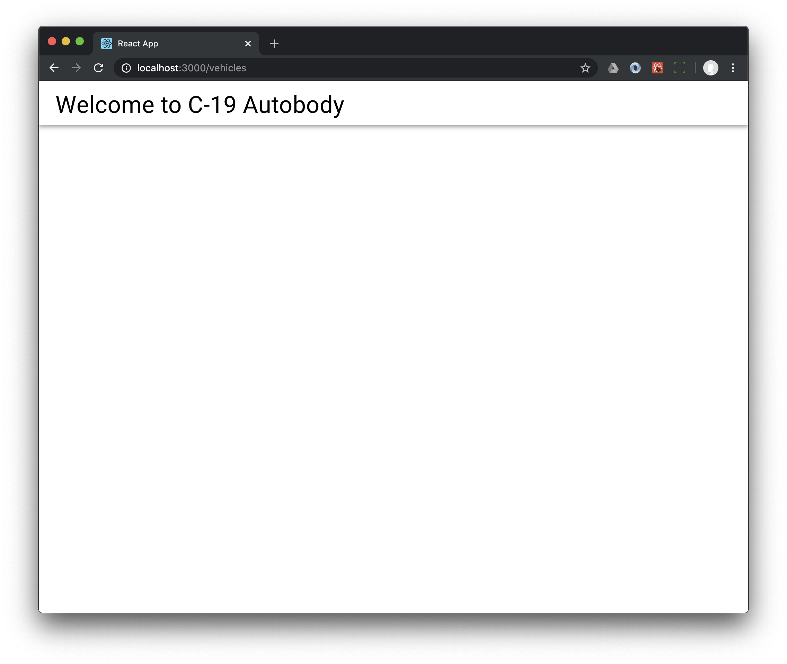
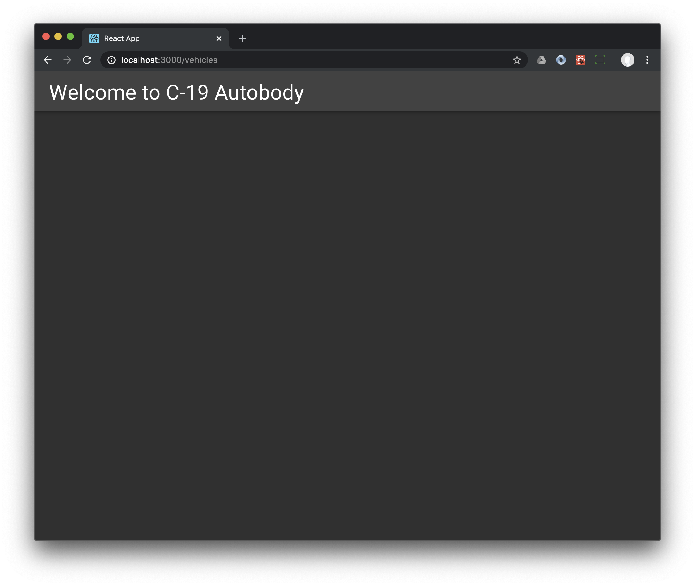

```shell
yarn add @material-ui/core
```

## A trivial page with a toolbar

Replace `App.tsx` with this

```
import React from 'react';
import { AppBar, Toolbar, Typography } from '@material-ui/core';

function App() {
  return (
    <AppBar color="inherit" position="static">
      <Toolbar>
        <Typography variant="h4">Welcome to C-19 Autobody</Typography>
      </Toolbar>
    </AppBar>
  );
}

export default App;
```



## Do you like dark theme?

If you like your Material theme dark, change your `index.tsx` to 

```
import React from 'react';
import ReactDOM from 'react-dom';
import App from './App';
import * as serviceWorker from './serviceWorker';
import { createMuiTheme, ThemeProvider, CssBaseline } from '@material-ui/core';

const theme = createMuiTheme({
  palette: {
    type: 'dark',
  },
});

ReactDOM.render(
  <React.StrictMode>
    <ThemeProvider theme={theme}>
      <CssBaseline />
      <App />
    </ThemeProvider>
  </React.StrictMode>,
  document.getElementById('root')
);

// If you want your app to work offline and load faster, you can change
// unregister() to register() below. Note this comes with some pitfalls.
// Learn more about service workers: https://bit.ly/CRA-PWA
serviceWorker.unregister();
```

## The upshot

You added Material UI to your tiny starter React application and went for the dark theme. You made a simple application bar. 


