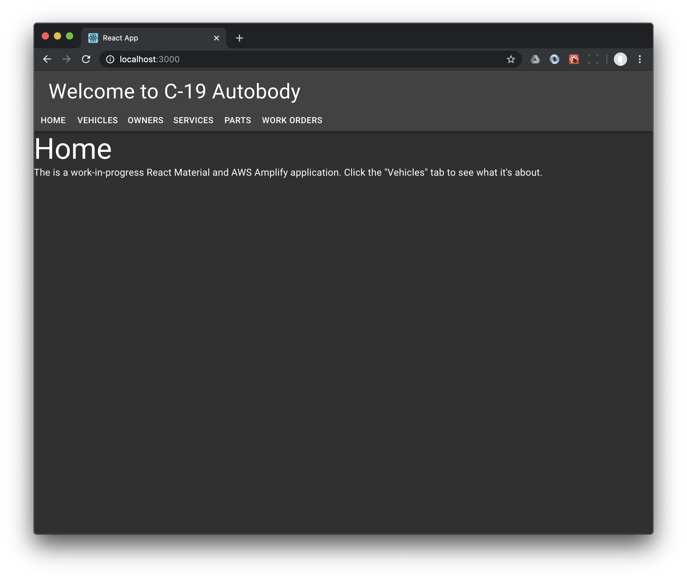

!!! info
    If you get turned around with the sequence of updates we're going to make with files, or if you'd rather the TL;DR, find "The upshot" at the end of each page. Let us know in the comments if we missed one.

Well, first we need to make pages for all the things you'll be dealing with in an autobody shop: Vehicles, Owners, Services, Parts, and Work Orders. 

Let's set up a row of buttons for that. They won't be plugged in yet. We'll get to that shortly.

Replace `App.tsx` with

```typescript
import React from 'react';
import { AppBar, Toolbar, Typography, Button } from '@material-ui/core';

function App() {
  return (
    <>
      <AppBar color="inherit" position="static">
        <Toolbar>
          <Typography variant="h4" >Welcome to C-19 Autobody</Typography>
        </Toolbar>
        <div>
          <Button>Home</Button>
          <Button>Vehicles</Button>
          <Button>Owners</Button>
          <Button>Services</Button>
          <Button>Parts</Button>
          <Button>Work Orders</Button>
        </div>
      </AppBar>
    </>
  );
}

export default App;
```

Try it. 

Getting better. We can argue about spacing later. The out-of-the-box spacing is at least not completely wrong.

## Create stubs for all the components

For the Home component, simply add the file `Home.tsx` in the `src` directory with the content below. We're going to add routing to these in bit.

```typescript
import React from 'react';
import { Typography } from '@material-ui/core';

function Home() {
    return (
        <>
            <Typography variant="h3">Home</Typography>
            <Typography variant="body1">The is a work-in-progress React Material and AWS Amplify application.
            Click the "Vehicles" tab to see what it's about.</Typography>
        </>
    );
}

export default Home;
```

Now create `Vehicles.tsx`.

```typescript
import React from 'react';
import { Typography } from '@material-ui/core';

function Vehicles() {
    return (
        <Typography variant="h3">Vehicles</Typography>
    );
}

export default Vehicles;
```

And `Placeholder.tsx`

```typescript
import React from 'react';
import { Typography } from '@material-ui/core';

function Placeholder() {
    return (
        <Typography variant="h3">Placeholder</Typography>
    );
}

export default Placeholder;
```

Now we're ready to add routing to those components. We call out `Vehicles.tsx` separately because that's the component we're going to work on first.

## Add routes to those stubs

First add the `react-router-dom` dependency and TypeScript definitions.

```shell
yarn add react-router-dom @types/react-router-dom
```

Now wrap the `App` component in a `<BrowserRouter>` ... `</BrowserRouter>`. The easiest place to do this is in `index.tsx`.

Add the import to `index.tsx`.

```typescript
import { BrowserRouter } from "react-router-dom";
```

And then wrap the existing `<App />` like this

```typescript
ReactDOM.render(
  <React.StrictMode>
    <ThemeProvider theme={theme}>
      <CssBaseline />
      <BrowserRouter>
        <App />
      </BrowserRouter>
    </ThemeProvider>
  </React.StrictMode>,
  document.getElementById('root')
);
```

## Add some actual routing

It's actually pretty easy now we have the stub components and the `<BrowserRouter>` wrapper.

Add `<Link>`s and URL paths to the `<Button>`s in the `<AppBar>` in `App.tsx`.

```typescript
import { Link } from 'react-router-dom';
```

!!! note
    There's an export `<Link>` from `@material-ui/core`. We don't want that one.
    

```typescript hl_lines="8 9 10 11 12 13 14 15"
function App() {
  return (
    <>
      <AppBar color="inherit" position="static">
        <Toolbar>
          <Typography variant="h4" >Welcome to C-19 Autobody</Typography>
        </Toolbar>
        <div>
          <Link to="/" component={Button}>Home</Link>
          <Link to="/vehicles" component={Button}>Vehicles</Link>
          <Link to="/owners" component={Button}>Owners</Link>
          <Link to="/services" component={Button}>Services</Link>
          <Link to="/parts" component={Button}>Parts</Link>
          <Link to="/workorders" component={Button}>Work Orders</Link>
        </div>
      </AppBar>
    </>
  );
}
```

Now add a dispatcher for the URL paths to the corresponding components.

```typescript
import { Route, Switch, Link } from 'react-router-dom'
import Placeholder from './Placeholder';
import Home from './Home';
import Vehicles from './Vehicles';
```

```typescript hl_lines="7 8 9 10 11 12 13 14 15 16"
  return (
    <>
      <AppBar color="inherit" position="static">
        ...
      </AppBar>

      <main>
        <Switch>
          <Route path="/" component={Home} exact />
          <Route path="/vehicles" component={Vehicles} />
          <Route path="/owners" component={Placeholder} />
          <Route path="/services" component={Placeholder} />
          <Route path="/parts" component={Placeholder} />
          <Route path="/workorders" component={Placeholder} />
        </Switch>
      </main>
    </>
  );
```

Try it with `yarn start` as usual.

!!! warning
    We know. The application looks dreadful right now. We're going to clean it up a bit in a bit.

## The upshot

After all our changes, here's where we ended up.

`index.tsx` is

```typescript
import React from 'react';
import ReactDOM from 'react-dom';
import './index.css';
import App from './App';
import * as serviceWorker from './serviceWorker';
import { createMuiTheme, ThemeProvider, CssBaseline } from '@material-ui/core';
import { BrowserRouter } from "react-router-dom";

const theme = createMuiTheme({
  palette: {
    type: 'dark',
  },
});

ReactDOM.render(
  <React.StrictMode>
    <ThemeProvider theme={theme}>
      <CssBaseline />
      <BrowserRouter>
        <App />
      </BrowserRouter>
    </ThemeProvider>
  </React.StrictMode>,
  document.getElementById('root')
);

// If you want your app to work offline and load faster, you can change
// unregister() to register() below. Note this comes with some pitfalls.
// Learn more about service workers: https://bit.ly/CRA-PWA
serviceWorker.unregister();
```

`App.tsx` is

```typescript
import React from 'react';
import { AppBar, Toolbar, Typography, Button } from '@material-ui/core';
import { Link, Route, Switch } from 'react-router-dom';
import Home from './Home';
import Vehicles from './Vehicles';
import Placeholder from './Placeholder';

function App() {
  return (
    <>
      <AppBar color="inherit" position="static">
        <Toolbar>
          <Typography variant="h4" >Welcome to C-19 Autobody</Typography>
        </Toolbar>
        <div>
          <Link to="/" component={Button}>Home</Link>
          <Link to="/vehicles" component={Button}>Vehicles</Link>
          <Link to="/owners" component={Button}>Owners</Link>
          <Link to="/services" component={Button}>Services</Link>
          <Link to="/parts" component={Button}>Parts</Link>
          <Link to="/workorders" component={Button}>Work Orders</Link>
        </div>
      </AppBar>

      <div>
        <main>
          <Switch>
            <Route path="/" component={Home} exact />
            <Route path="/vehicles" component={Vehicles} />
            <Route path="/owners" component={Placeholder} />
            <Route path="/services" component={Placeholder} />
            <Route path="/parts" component={Placeholder} />
            <Route path="/workorders" component={Placeholder} />
          </Switch>
        </main>
      </div>
    </>
  );
}

export default App;
```

As we pointed out above, it's not going to win any design awards. Keep going anyway just in case we fix it.



