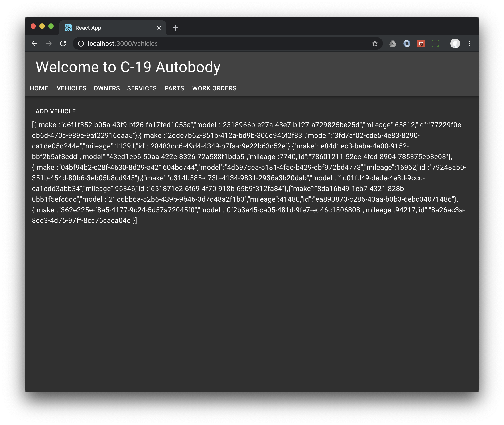

We're going to add code to one of the pages, vehicles, to add a vehicle and list them out. We just generate random values for fields for now. And it won't be hooked up to the back end. But this will let us see how to update state and display the complete list. 

## A little layout

Lets solve the ugly indentation of the "Vehicles" header. Actually, let's solve the problem for all pages at the same time. This is easy: Just add a simple style to `App.tsx`. 

We already dipped our toe in the water in the authentication UI if you decided to do it. We're just going to add another style to `App.tsx`.

```typescript
import { makeStyles } from '@material-ui/core';

const useStyles = makeStyles((theme) => ({
  content: {
    // top, right, bottom, left
    margin: theme.spacing(2, 2, 0, 2)
  }
}));
```

The `theme` argument lets us use spacing from the theme itself. We could use hard-coded pixel sizes, but we'd have to update all those manually every time the theme changes. That would be not only annoying, but in addition your pull request would be rejected and no one on your team will want to go to lunch with you today.

`makeStyles()` returns a function. We get the classes lookup from the result of calling this function. And we use it referencing the class name. Look at the `<div>` around the `<Switch>`.

```typescript hl_lines="2 16 23"
function App() {
  const classes = useStyles();

  return (
    <>
      <AppBar color="inherit" position="static">
        <Toolbar>
          <Typography variant="h4" >Welcome to C-19 Autobody</Typography>
        </Toolbar>
        <div>
          <Link to="/" component={Button}>Home</Link>
          ...
        </div>
      </AppBar>

      <div className={classes.content}>
        <main>
          <Switch>
            <Route path="/" component={Home} exact />
            ...
          </Switch>
        </main>
      </div>
    </>
  );
}
```

Try it.

It's looking quite a bit better. We have every right to be chuffed.

## Generate GraphQL models

We defined a model for a vehicle in the previous chapter.

```
type Vehicle @model {
  id: ID!
  make: String!
  model: String!
  mileage: Int
}
```

Now generate TypeScript type definitions.

```shell
amplify codegen models
```

In case you're wondering, this is what's generated.

```typescript
import { ModelInit, MutableModel, PersistentModelConstructor } from "@aws-amplify/datastore";

export declare class Vehicle {
  readonly id: string;
  readonly make: string;
  readonly model: string;
  readonly mileage?: number;
  constructor(init: ModelInit<Vehicle>);
  static copyOf(source: Vehicle, mutator: (draft: MutableModel<Vehicle>) => MutableModel<Vehicle> | void): Vehicle;
}
```

A bit of a mouthful, but it's going to be super useful. We can use the generated classes intact.

## Now add some state for the list of vehicles

Import the new `Vehicle` class

```typescript
import { Vehicle } from './models';
```

We maintain state using React hooks. See <https://reactjs.org/docs/hooks-overview.html>. Hooks are so cool.

```typescript
const [vehicles, setVehicles] = React.useState<Vehicle[]>([])
```

Here is `Vehicles.tsx`

```typescript hl_lines="3 6"
import React from 'react';
import { Typography } from '@material-ui/core';
import { Vehicle } from './models';

function Vehicles() {
    const [vehicles, setVehicles] = React.useState<Vehicle[]>([])

    return (
        <Typography variant="h3">Vehicles</Typography>
    );
}

export default Vehicles;
```

We'll be using random placeholders for fields: UUIDs are just the ticket.

```shell
yarn add uuidv4 @types/uuid 
```

And import it

```typescript
import { uuid } from 'uuidv4';
```

## Code to update the list of vehicles

A new function, `addVehicle()`, adds a vehicle to the `vehicles` state.

```typescript
function addVehicle() {
    const make = uuid();
    const model = uuid();
    const mileage = Math.floor(Math.random() * 100000) + 1 
    const vehicle = new Vehicle({ make, model, mileage });

    setVehicles([...vehicles, vehicle]);
}
```

!!! note
    The `Vehicle` class contains metadata that Amplify runtime uses for persistence. This is out-of-bounds for us to update directly. However all persistent classes derived from `schema.graphql` — including our `Vehicle` class — include a constructor with just our fields except `id`, which is considered part of the metadata.

Add a `<Button onClick{...}>` handler. This also needs to be inside the main function.

```typescript
function onClick(event: React.MouseEvent) {
    console.log('event', event);

    addVehicle();

    event.preventDefault();
}
```

The `event.preventDefault();` is necessary because React decorates native DOM events and we don't want the browser to refresh or reload the window with the underlying event.

Add a `<Button>` and wire up the `onclick()` handler, and replace the existing `<Typography>` element with some JSON.

```typescript
import { Typography, Button } from '@material-ui/core';
```

```typescript
return (
    <>
        <Button onClick={onClick}>Add vehicle</Button>
        <Typography>{JSON.stringify(vehicles)}</Typography>
    </>
);
```

Try it out, `yarn start` as usual.

Nice. Now there's a button "ADD VEHICLE" and some JSON for all the vehicles we're adding.

## The upshot

We make a very primitive component that updates and displays state. 

`Vehicles.tsx` is now

```typescript
import React from 'react';
import { Typography, Button } from '@material-ui/core';
import { Vehicle } from './models';
import { uuid } from 'uuidv4';

function Vehicles() {
    const [vehicles, setVehicles] = React.useState<Vehicle[]>([]);

    function addVehicle() {
        const make = uuid();
        const model = uuid();
        const mileage = Math.floor(Math.random() * 100000) + 1
        const vehicle = new Vehicle({ make, model, mileage });

        setVehicles([...vehicles, vehicle]);
    }

    function onClick(event: React.MouseEvent) {
        console.log('event', event);

        addVehicle();

        event.preventDefault();
    }

    return (
        <>
            <Button onClick={onClick}>Add vehicle</Button>
            <Typography>{JSON.stringify(vehicles)}</Typography>
        </>
    );
}

export default Vehicles;
```



!!! note
    If you have a keen eye, you'll see that the Amplify runtime has already created values for the `id` fields when new did `new Vehicle({ make, model, mileage })`. This also happens to be a UUID. Just not one of the ones we assigned explicitly. 
    
    This explanation's a bit confusing. Sorry about that.
