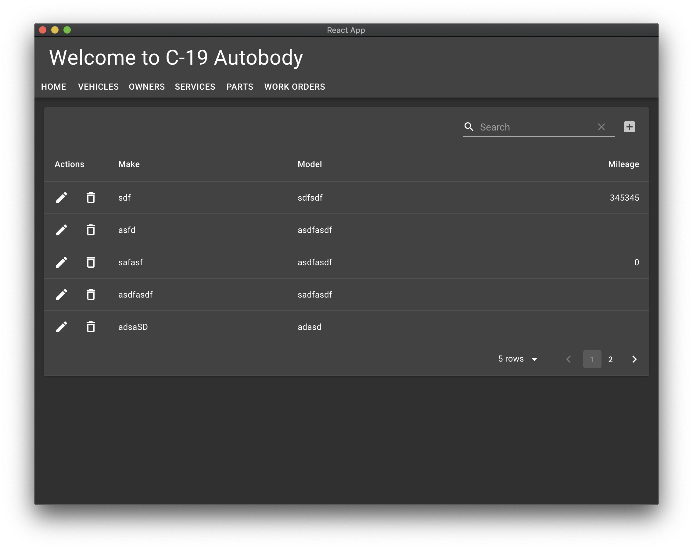

Material Table takes options. Lots of options. Let's use a couple of quick ones here.

Remove the total number of rows for the display in pagination.

```typescript
const localization = {
    pagination: {
        labelDisplayedRows: '{from}-{to}'
    }
}
```

Remove the title and change the way we display pages.

```typescript
const options: Options = {
    showTitle: false,
    showFirstLastPageButtons: false,
    paginationType: "stepped",
}
```

So now our Material Table declaration looks like

```typescript
<MaterialTable
    tableRef={tableRef}
    data={data}
    columns={columns}
    editable={editable}
    localization={localization}
    options={options}
/>
```

!!! todo
    More polish needed here

    - Fix screen flash

    - Update total number of rows

## The upshot

We integrated Amplify DataStore and Material Table. I think it was well worth it. It would have taken ages to do this from scratch.

There are some wrinkles, but not enough we can't press on.

Our final `Vehicles.tsx` is this

```typescript
import React, { useEffect, createRef } from 'react';
import { Grid } from '@material-ui/core';
import { Vehicle } from './models';
import { DataStore, SubscriptionMessage } from '@aws-amplify/datastore';
import MaterialTable, { Column, Query, QueryResult, MaterialTableProps, Options } from 'material-table'

const columns: Column<Vehicle>[] = [
    { title: 'Make', field: 'make' },
    { title: 'Model', field: 'model' },
    { title: 'Mileage', field: 'mileage', type: "numeric", emptyValue: '' },
];

function Vehicles() {
    const tableRef = createRef<MaterialTableProps<Vehicle>>();

    useEffect(() => {
        function subscriber(msg: SubscriptionMessage<Vehicle>) {
            console.log('subscription', msg.opType);

            if (tableRef.current) {
                const table = tableRef.current;

                if (table.onQueryChange) {
                    table.onQueryChange({
                        filters: [],
                        orderBy: {},
                        orderDirection: 'asc',
                        page: table.page || 0,
                        pageSize: table.options?.pageSize || 5,
                        search: table.options?.searchText || ''
                    });
                }
            }
        };

        const subscription = DataStore
            .observe(Vehicle)
            .subscribe(subscriber);

        return () => { subscription.unsubscribe(); };
    }, [tableRef]);

    function rowMapper(vehicles: Vehicle[]): Vehicle[] {
        return vehicles.map(vehicle => {
            return { ...vehicle }
        });
    }

    function data(query: Query<Vehicle>): Promise<QueryResult<Vehicle>> {
        return new Promise((resolve, reject) => {
            const thisPage = {
                page: query.page,
                limit: query.pageSize
            };

            DataStore
                .query(Vehicle,
                    criteria => criteria.or(orTerms => orTerms
                        .make("contains", query.search)
                        .model("contains", query.search)
                        .mileage("ge", parseInt(query.search))),
                    thisPage)
                .then(vehicles => {
                    resolve({
                        data: rowMapper(vehicles),
                        page: query.page,
                        totalCount: 1000000
                    });
                })
                .catch(reject);
        })
    }

    const onRowAdd = (newData: any) =>
        new Promise((resolve, reject) => {
            const timeout = setTimeout(() => {
                const add = new Vehicle({
                    make: newData.make,
                    model: newData.model,
                    mileage: parseInt(newData.mileage, 10)
                });
                DataStore
                    .save(add)
                    .then(result => {
                        clearTimeout(timeout)

                        resolve(result);
                    })
                    .catch(reject)
            }, 1000);
        })

    const onRowDelete = (oldData: any) =>
        new Promise((resolve, reject) => {
            const timeout = setTimeout(() => {
                DataStore
                    .delete(Vehicle, oldData.id)
                    .then(result => {
                        clearTimeout(timeout)

                        resolve(result);
                    })
                    .catch(reject)
            }, 1000);
        })

    const onRowUpdate = (newData: any, oldData: any) =>
        new Promise((resolve, reject) => {
            const timeout = setTimeout(() => {
                DataStore
                    .query(Vehicle, oldData.id)
                    .then(original => {
                        const updated = Vehicle.copyOf(original, updated => {
                            updated.make = newData.make
                            updated.model = newData.model
                            updated.mileage = parseInt(newData.mileage, 10)
                        });

                        return DataStore.save(updated);
                    })
                    .then(result => {
                        clearTimeout(timeout)

                        resolve(result);
                    })
                    .catch(reject)
            }, 1000);
        })

    const editable = {
        onRowAdd,
        onRowDelete,
        onRowUpdate
    }

    const localization = {
        pagination: {
            labelDisplayedRows: '{from}-{to}'
        }
    }

    const options: Options = {
        showTitle: false,
        showFirstLastPageButtons: false,
        paginationType: "stepped",
    }

    return (
        <Grid container spacing={2}>
            <Grid item xs={12}>
                <MaterialTable
                    tableRef={tableRef}
                    data={data}
                    columns={columns}
                    editable={editable}
                    localization={localization}
                    options={options}
                />
            </Grid>
        </Grid>
    );
}

export default Vehicles;
```

